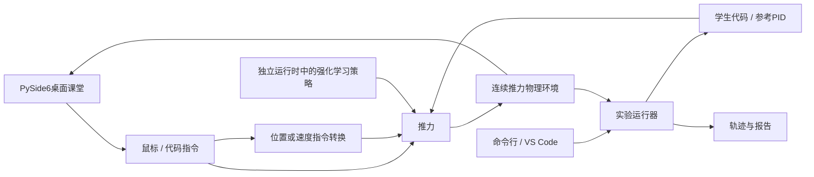

# 教学体验与工程架构

本文保留 0.1.0 阶段的架构说明与后续设计，不作为 0.2.0 功能完成清单。当前实现、验收证据和剩余限制见 [实现审计](IMPLEMENTATION_AUDIT.md)；运行命令见 [README](../README.md)。原始接口规划见 [详细代码规划](DEVELOPMENT_PLAN.md)，教学安排见 [路线图](ROADMAP.md)。

ControlLab 的核心是“先体验，再观察，再编程，最后解释算法”。界面按学习阶段逐步展示概念，物理仿真和实验规则保持可复用，让学生能把亲手操作、Python 规则、PID 和后续强化学习连成一条学习线。

## 教学界面如何递进

| 阶段 | 展示的信息 | 主要操作 | 暂不展示 |
| --- | --- | --- | --- |
| 亲手试试 | 倒立摆动画、简短目标和重试提示 | 鼠标拖动中央小车或滑块 | 数学公式、PID参数、代码、密集数据 |
| 看见变化 | 逐项介绍位置、速度、倾斜角、倾倒速度 | 操作同时观察数值和方向 | 未解释的公式和算法缩写 |
| 第一段代码 | 少量Python、即时结果、简短错误提示 | 输出推力或目标速度，修改数字与条件 | 大段框架代码、复杂工程配置 |
| 自动平衡 | 误差、P/PD/PID、曲线及比较 | 调参、运行与解释失败 | 尚未教学的训练细节 |
| 自己学习 | 状态、动作、奖励、训练和评估 | 训练策略并和已有控制器比较 | 与当前问题无关的模型配置 |

0.1.0 首先实现了前三个阶段。0.2.0 已增加传统控制面板、正式评价、32 课资源与独立强化学习入口；需要外部运行时的课程和仍未完成的活动在实现审计中分别注明。

动画应清晰展示小车、杆、轨道及移动方向。引导文字围绕一个当前可操作的小目标，说明操作产生的结果。颜色、留白和状态反馈保持一致；装饰不能遮挡杆与小车，错误提示不要求新手阅读程序堆栈。

## 功能分层

桌面课堂通过 `TeachingSimulation` 调用共用物理环境，另行设置教学任务的终止阈值和回合长度。绘图代码不重写动力学。界面计时器推进固定物理步，窗口刷新耗时不等于控制周期。

| 文件或目录 | 职责 |
| --- | --- |
| `src/control_lab/envs/cartpole.py` | Gymnasium风格的连续推力动力学、动作空间、观测与终止条件 |
| `src/control_lab/desktop/app.py` | PySide6课程导航、动画、操作引导、观测显示与短代码交互 |
| `src/control_lab/desktop/engine.py` | 独立于Qt的课堂运行逻辑、输入转换与学生代码执行 |
| `src/control_lab/controllers/reference_pid.py` | 可阅读的参考控制律；默认角度PD加位置、速度反馈 |
| `examples/first_action.py` | 第三课的短函数；VS Code调试时加载到桌面编辑器 |
| `examples/my_controller.py` | 在VS Code中编辑的完整学生控制器接口 |
| `src/control_lab/runner.py` | 批量实验、控制器调用、回合终止、轨迹与报告 |
| `src/control_lab/cli.py` | 无参数或gui子命令启动桌面；保留run、doctor、init-workspace命令 |
| `setup.ps1` | 创建独立开发环境 |
| `scripts/build_windows.ps1` | 将应用与依赖构建为Windows便携目录 |
| `packaging/windows/installer.iss` | 安装向导模板、快捷方式与卸载入口 |

## 共享物理约定

环境的观测顺序为 `x, x_dot, theta, theta_dot`，单位为 m、m/s、rad、rad/s。桌面代码使用 `v` 和 `omega` 作为速度、角速度的别名。观察课卡片把角度和角速度换算为 ° 与 °/s，代码接口仍使用 rad 与 rad/s。杆角度零点是竖直向上。

环境最终接收牛顿推力，限幅为 −10～+10 N，物理步长为 0.02 s。鼠标位置或目标速度属于教学输入，需要经过明确的转换再施加推力。目标速度模式以 `8 * (目标速度 - 当前速度)` 计算推力，再进行力限幅。这是软件内部的速度反馈环，应在模式说明中标注，不应与直接输出推力的算法混为同一实验条件。

桌面短函数为 `control(state, dt)`，其中 `state` 是包含 `x/v/theta/omega` 的字典，返回一个数。当前输出模式决定该数表示牛顿推力还是以m/s计的目标速度。保存功能将短函数写入用户工作区的 `lesson03_时间戳.py`，不会转换为命令行控制器类。

命令行兼容 `Controller.reset()` 和 `Controller.act(observation, dt)`，后者返回有限实数推力；`reset()` 清空积分、滤波和历史状态。0.2.0 的公共适配器也接受 `control(state, dt)` 和可选 `reset()`，因此短函数可以交给正式评价的 `--controller-file`，初学者无需先学习类语法。

当前任务配置如下；共享物理方程不代表共享评估条件。

| 条件 | 桌面课堂 | 命令行默认实验 |
| --- | --- | --- |
| 初始状态 | 小车居中、杆完全竖直，两种速度为零 | 直立附近随机初始化 |
| 杆角终止阈值 | 80° | 12° |
| 回合步数上限 | 500,000 | 500 |
| 物理步长 | 0.02 s | 0.02 s |
| 推力限幅 | ±10 N | ±10 N |

正式算法比较时必须统一初始条件、终止阈值、回合长度、限幅与动作定义，保存原始指令和实际推力。课堂自由体验结果不能直接作为命令行基准成绩。

0.2.0 强化学习复用连续推力任务，训练和回放使用相同的动作映射。已有离散CartPole策略不能直接控制连续推力环境。

## 开发与使用数据分离

开发者在独立 `.venv` 中运行PySide6界面和仿真，通过VS Code修改代码。工程采用可编辑安装，保存源文件并重新运行即可看到变化，不必每次重新打包。

分发后，应用代码位于安装目录，学生文件和实验数据位于用户可写目录。命令行默认学生工作区是 `Documents\ControlLab\workspace`，默认记录目录是 `Documents\ControlLab\runs`。工作区初始化保留已经存在的学生文件。

桌面学生代码在子进程中执行，超时会终止，用于避免死循环卡住教学界面。这不是安全沙箱：本地学生代码仍具有普通Python程序的能力，当前面向用户自己与可信学生编写代码的教学场景。后续若需要收集并运行远程提交，必须另行设计执行隔离，不能把桌面代码编辑器当作安全边界。

## 下一步开发顺序

1. **验证前三阶段。** 新手无需帮助即可开始拖动、理解提示、读取观测并运行第一段代码；在缩放和不同窗口尺寸下保持动画可见。
2. **完成Python练习引导。** 用“改数字→用变量→写条件→封装函数”逐步减少提示，保留重试与清晰错误反馈。
3. **接入控制课程。** 围绕同一实验加入P、PD、积分与回中，提供参数对照、曲线和解释题。
4. **接入强化学习。** 单独增加可选训练依赖、模型保存和评估，明确训练状态，复用同一环境与比较条件。
5. **验证安装交付。** 在没有开发环境的Windows机器上确认启动、操作、保存、快捷方式和卸载，再对外发布安装包。

PyInstaller生成无控制台的桌面入口 `ControlLab.exe` 与控制台入口 `ControlLabCLI.exe`，二者共享 `_internal` 依赖目录，必须连同整个文件夹分发。Inno Setup模板负责安装流程与开始菜单入口。已有脚本和模板是构建基础，最终是否可交付还需对实际生成的程序做验证。
