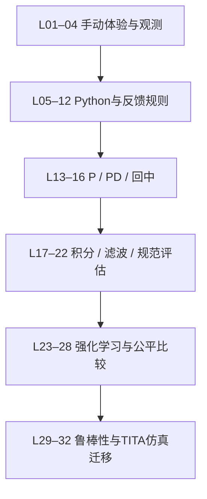

# ControlLab 详细课程与开发路线图

规划日期：2026-10-07。对象：第一次接触编程和控制的学生；维护者会Python、有嵌入式基础、少量ROS基础，每周可投入6–8小时。

本文保留最初的教学与开发规划，不作为 0.2.0 的现状清单。32 课资源、控制面板、独立训练和更新入口已进入实现；逐课可执行范围、验证证据与未完成项以 [实现审计](IMPLEMENTATION_AUDIT.md) 为准，运行命令见 [README](../README.md)。是否已发布版本或完成机器人实验需另看对应验收记录。

## 1. 如何使用这套规划

| 你要做的事 | 阅读文档 |
| --- | --- |
| 看全局顺序、排期、每阶段交付 | 本文 |
| 准备零基础手动/Python课程 | [L01–L12基础课程](curriculum/01_FOUNDATIONS.md) |
| 准备P、PD、回中、积分和评估 | [L13–L22传统控制课程](curriculum/02_FEEDBACK_CONTROL.md) |
| 准备RL、比较实验和TITA迁移 | [L23–L32强化学习与TITA](curriculum/03_RL_AND_TITA.md) |
| 开始改代码、拆分文件与编写验证 | [详细代码规划](DEVELOPMENT_PLAN.md) |
| 读取结构化课表/评估草案 | [课程目录JSON](plans/lesson_catalog.json)、[评估协议JSON](plans/benchmark_v1.proposal.json) |
| 查看示例和参数核对的范围 | [规划核对记录](PLAN_REVIEW.md) |

`docs/plans` 中的 JSON 保留为规划附件；实际课程来自 `src/control_lab/lessons/content`，正式协议来自 `evaluation/assets/balance-v1.json`。下文“拟新增”描述原始设计意图，实际 API 和 CLI 以代码与 README 为准，各课程 DEV-F/C/R 条目用于追踪需求。

## 2. 教学主线与边界

教学遵循四条约定：

1. **先碰到问题，再引入术语。** 学生先发现追不上、来回摆、一直漂、力量到顶，再学习P、D、积分和饱和。
2. **学生主线始终输出牛顿。** 速度模式作为L11支线；鼠标辅助体验不参与PID/RL正式评分。
3. **失败是实验结果。** 第一课自由开放，没有倒下惩罚；比例控制课不以长期平衡作为唯一通过条件。
4. **界面随课程展开。** 第一课仅动画、必要操作与右侧引导。数据、曲线、代码、参数、训练指标按需出现，不恢复已删除的装饰小字。

原型阶段的“不跟手”来自有限力位置伺服与抓取点偏移，因此规划列为 M0。0.2.0 已实现抓取偏移和受驱动位置辅助；其动力学、测试证据与缩放限制见实现审计。辅助模式必须正确驱动杆的运动，不能只修改小车显示坐标。

目前“重新扶正”是全零静止状态。它用于开始探索；正式控制任务必须另行施加非零初态或可复现扰动，否则不控制也可以一直直立，不能据此评价算法。

## 3. 每一课的固定交付结构

教师备课材料与学生界面不是同一份长文。每课教师规格包含：前置知识、目标、预计时间、教师提问、编号实验步骤、学生代码、预期现象、误区、三层提示、验收证据、拟开发模块。

学生一屏只看到当前步骤：一句目标、一个可执行动作、一个结果观察点；需要时展开帮助。教师材料中的长解释不全部塞进软件。

每课实施完成应交付：

- 一份课程配置和前置关系；新手不需要手工改配置文件。
- 一份不超过当前知识范围的起始代码；无代码课明确不要求写代码。
- 教师参考答案、预期失败案例、复现实验配置。
- 学生作业目录和可追溯的实验记录。
- 一段教师演示流程与一次新手试讲记录。
- 与新增行为直接相关的验证结果。

## 4. 32课总表

表中的课时是课堂设计区间；训练等待和自主练习另计。学生可以拆课学习，不要求按开发者每周工时安排自己的进度。

| 课号 | 主题 | 新增知识 | 学生产物 | 实现阶段 |
| --- | --- | --- | --- | --- |
| L01 | 自由拖动、感受平衡 | 动作会影响摆杆 | 两条自己的操作发现 | M0/M1 |
| L02 | 扶正、暂停与扰动 | 初态、外扰、重新开始 | 同一扰动的两次观察 | M0/M1 |
| L03 | 位置与速度 | 在哪里/移动多快 | 读数与现象对应表 | M1 |
| L04 | 角度与角速度 | 倾多少/倒多快，单位 | 两个状态的动作判断 | M1 |
| L05 | 第一条推力指令 | 数字、正负、return | 修改输出方向的小函数 | M2 |
| L06 | 变量与单位 | 变量、字典取值、计算 | 能解释单位的代码 | M2 |
| L07 | 条件与死区 | if/elif/else、比较 | 按状态选择动作的规则 | M2 |
| L08 | 反馈函数与dt | 软件重复调用函数 | 一步反馈流程图 | M2 |
| L09 | 时间与记忆 | 累计、状态、reset | 可重置的定时推力程序 | M2 |
| L10 | 记录与调试 | 曲线、错误定位、复现 | 错误修正记录和实验快照 | M2 |
| L11 | 目标速度支线 | 速度指令不等于力 | 两种输入的对照表 | M2 |
| L12 | 第一条角度反馈 | 读数乘系数 | 待命名的比例规则 | M2 |
| L13 | 比例P与符号 | 偏差决定动作大小 | 正负方向预测与记录 | M3 |
| L14 | P调参、振荡、饱和 | 一次只改一个参数 | 参数扫描表 | M3 |
| L15 | 从P到PD | 倾倒速度与提前动作 | P/PD曲线对照 | M3 |
| L16 | 杆稳住后让车回中 | 多状态反馈、耦合 | 角度与位置共同报告 | M3 |
| L17 | 积分I：持续误差 | 累计误差、PI | 单车速度场景P/PI对照 | M4 |
| L18 | 抗积分饱和 | 输出限幅、条件积分 | 三种积分处理的比较 | M4 |
| L19 | 控制器生命周期 | 记忆与回合重置；类为选修 | 可重复运行的完整控制器 | M4 |
| L20 | 测量噪声与滤波 | 差分、低通、微分冲击 | 滤波收益和代价分析 | M4 |
| L21 | 规范比较传统方法 | 协议、统计、保留集 | 完整批量评价报告 | M4 |
| L22 | 我的控制项目 | 复现、解释、交付 | 可由同学复现的项目包 | M4 |
| L23 | 随机策略与RL概念 | 观测、动作、策略、回合 | 状态转移图、随机基线 | M5 |
| L24 | 奖励设计 | 即时奖励与回报 | 奖励说明及轨迹重计分 | M5 |
| L25 | 环境接口 | reset/step、动作空间、结束原因 | 环境契约检查记录 | M5 |
| L26 | 第一次PPO训练 | 采样、更新、验证 | 三个独立训练run与报告 | M5 |
| L27 | 模型保存与复现 | 元数据、归一化、继续训练 | 可重载策略包与对照实验 | M5 |
| L28 | PID与RL公平比较 | 同协议、成本、失败分析 | 核心课程结业报告 | M5 |
| L29 | 延迟、噪声、模型变化 | 鲁棒性与单因素实验 | 因素—预测—结果表 | M7 |
| L30 | 倒立摆到轮足机器人 | 观测/动作映射和控制层级 | TITA接口概念图 | M7 |
| L31 | TITA官方仿真复现 | 外部环境、回放、策略导出 | 固定版本复现记录 | M7 |
| L32 | 迁移报告与实机前准备 | 差异、停止、实验分阶段 | 迁移计划；不默认驱动硬件 | M7 |

L01–L12通常可拆成45–60分钟小课；L13–L21约60–90分钟，L22项目展示为120–150分钟；L23–L30约50–60分钟，L31/32各建议两节。结构化目录所列全部32课约35–38小时课堂活动，核心L01–L28约29–32小时，另留自主练习和训练等待时间，而不是承诺所有零基础学生固定几周学会。

## 5. 三个阶段性成果

### 成果A：学弟能独立写出会动的小程序（L01–L12）

验收：第一次打开会拖车；能区分四个观测；能写正/负/零力和一个条件；能修正一个缩进或返回值错误；保存后下次继续；无需理解类或依赖安装。

### 成果B：能交付有证据的传统控制方案（L13–L22）

验收：解释P/D/I各用什么信息；知道Ki可以为零；知道杆站住与小车不漂是两个要求；能重置积分；按相同协议比较，不用全零静置或单次最好结果证明成功。

### 成果C：能训练、重载并公平评价一个RL策略（L23–L28）

验收：能说清奖励目标；训练与测试分开；保存模型所需配置；正确重载；把RL与传统方法放到同一组初始条件评价；能展示并解释失败。

TITA仿真是进阶成果D，依赖独立机器环境和准备时间。实机部署不作为成果C的前置，也不承诺与软件安装包同期完成。

## 6. 按每周6–8小时的开发排期

以下是单人开发教学MVP的起步预算，假设每周都能投入且复用当前代码。24周合计144–192小时，另预留20%–30%的试讲返工和环境适配缓冲；不是完成时间保证。若GUI/训练兼容性比预期复杂，先交付成果A/B，推后RL与机器人模块。

| 里程碑 | 周次/预算 | 完成内容 | 出阶段门槛 |
| --- | --- | --- | --- |
| M0 实验基础修正 | 1–3，18–24h | 抓取偏移、辅助位置原型、非零挑战、固定步时序 | 拖动能解释、扰动可复现、每步动作对应明确 |
| M1 课程框架 | 4–5，12–16h | JSON课程、步骤/提示、进度、L01–04 | 新手不用指导完成首课；关软件不丢进度 |
| M2 Python课程 | 6–8，18–24h | L05–12、reset函数、记录/调试、VS Code衔接 | 成果A；函数与CLI适配不冲突 |
| M3 P/PD与回中 | 9–11，18–24h | L13–16、参数/分量、对照场景 | 参考案例可复现，学生能解释方向与漂移 |
| M4 完整传统控制 | 12–15，24–32h | L17–22、独立速度PI、滤波、评分、项目包 | 成果B；协议标定，失败/超时都记录 |
| M5 RL课程 | 16–20，30–40h | L23–28、独立训练、模型包、统一评价 | 成果C；缺训练环境不影响基础课 |
| M6 安装与课堂发布 | 21–24，24–32h | 安装器、GitHub更新、升级保数据、试讲 | 全新Windows与旧版升级均走通 |
| M7 迁移选修 | 25周后，单独估时 | L29–32、鲁棒性、TITA外部仿真 | 有教师环境才实施；实机另立计划 |

### 每周具体任务

| 周 | 先做 | 再做 | 本周留下的证据 |
| --- | --- | --- | --- |
| 1 | 固化现有版本和行为；定义状态/动作单位 | 修抓取偏移；录拖动响应基线 | 同一鼠标路径的前后记录 |
| 2 | 将会话改成一步一动作 | 暂停/reset/迟到回包处理；非零挑战 | 生命周期验证与复现用例 |
| 3 | 验证受驱动位置体验原型 | 与力模式分开记录；邀请1–2人试拖 | 手感反馈、辅助模式适用边界 |
| 4 | 实现课程schema、加载器、依赖校验 | 右侧当前步骤与三层提示 | 一份可完整走通的L01配置 |
| 5 | 进度和作业保存 | 接L02–04，逐项展示观测 | 重开恢复、新手读数反馈 |
| 6 | 接L05–08，保护模板与学生副本 | 短函数错误提示和单位提示 | 4个教学模板/失败案例 |
| 7 | 增加可选reset，接L09–10 | GUI/CLI复用快照与记录 | 相同代码重复运行一致 |
| 8 | 接L11–12，VS Code载入与保存 | 成果A试讲，调整难点 | 学生独立完成的小程序 |
| 9 | 接L13/P分量显示 | 非零初态、符号与方向课 | 正负倾角对应首步动作证据 |
| 10 | 接L14–15与参数扫描 | P/PD同初态对照 | 预期振荡/失败/改善曲线 |
| 11 | 接L16回中与位置指标 | 复核角度/位置反馈符号 | 仅PD与加回中两套完整记录 |
| 12 | 实现独立速度场景 | 接L17恒负载P/PI | 稳态误差演示可重复 |
| 13 | 接L18–19积分与reset | 正/负饱和、释放、暂停 | 条件积分和状态重置证据 |
| 14 | 接L20噪声/滤波 | 实现协议和指标聚合 | 真值/观测分离与指标检查 |
| 15 | 接L21–22报告/项目导出 | 成果B试讲，标定评分门槛 | 同伴能复现的控制项目 |
| 16 | 选择并验证独立训练依赖 | 接L23–25、checker、动作映射 | 256步烟测和依赖锁文件 |
| 17 | 接训练服务与停止/检查点 | L26小预算CPU训练 | 第一组可重载策略与日志 |
| 18 | 三seed重复、验证集选模 | L27继续训练与奖励对照 | 元数据完整的模型包 |
| 19 | 接L28并列回放和比较 | 盲测配置冻结与评价 | PID/RL同协议报告 |
| 20 | 成果C试讲 | 修教学阻塞、训练中断和失败提示 | 学生能解释的训练报告 |
| 21 | 统一版本来源、验证Inno安装器 | 用户数据迁移和恢复 | 干净Windows首次安装记录 |
| 22 | GitHub发布草稿版本 | 检查更新/下载/取消/校验 | 两版本下载流程，不接实机 |
| 23 | 安装器交接与重启 | 更新失败/网络离线/旧作业保留 | v旧→v新完整升级记录 |
| 24 | 新手整段试讲与修复 | 发布说明、教师指引、手动发正式版 | 可交付安装包和课程版本 |

每周可采用：1小时整理课程目标、3–4小时实现、1–2小时运行与试讲、1小时整理证据。训练计算耗时单列；不能把电脑训练几小时当开发者投入了几小时教学设计。

## 7. 第一批代码任务的具体拆法

每项宜形成一个可独立审查的小变更，避免同时改界面、动力学、数据格式和课程内容。

1. **PR01 契约与抓取点。** 补状态/动作文档和抓取偏移；验证车身左、中、右按下但不移动都不自动跑车。先不改变力模型。
2. **PR02 会话时钟。** 将物理推进从QTimer回调中抽出；action带episode/step序号；延迟返回、暂停、reset都可预测。
3. **PR03 可复现实验。** 新增精确初值与外扰配置；全零扶正和非零挑战分开；同配置hash与初态可重放。
4. **PR04 辅助拖动。** 在独立模式实现连续位置轨迹和受驱动杆响应；对照原力模型；记录帮助模式与速度/加速度约束。
5. **PR05 一课走通。** 仅用L01实现课程加载、当前步骤、提示和进度；用真实新手试一次。
6. **PR06 观测课程。** L02–04逐项开放读数和单位，存观察作业；不引入PID控制参数。
7. **PR07 学生代码协议。** 增加可选reset、错误定位与保存快照，再接L05–10；与旧class接口兼容。
8. **PR08 Python到P。** 完成L11–12与L13，证明同一学生文件和实验器可以自然过渡，再继续后续课程。

公共代码任务DEV-E01–E16详见代码规划；教学需求分别由DEV-F、DEV-C、DEV-R条目补足。一个公共能力可能服务多课，不为每课复制一套仿真。

## 8. 界面与教学素材规格

- 保留当前深绿、浅底、橙色摆杆的视觉语言；课程内容不再添加英文眉题、鸡汤、版本号等装饰小字。
- 一个步骤至多新增一组信息。认识角度时高亮杆和角度读数；认识角速度时再开放对应读数，避免一次显示全部术语。
- 右侧引导包含“试一试”“观察什么”“需要提示”三个层次；长理论放展开区或教师文档。
- 控制器参数调整开新实验或记录明确的变更时刻；不让正在跑的旧轨迹与新参数混为一个结论。
- 代码编辑器保留学生作品，错误指出位置与可执行建议；教师答案另存，载入前不覆盖未保存内容。
- 后续主题的入口标注规划/待安装状态；不可点击的占位不会伪装成已可训练。
- 暂停、扶正、单步、挑战是不同动作，用明确动词；更新下载不打断运行中的课堂。
- 优先检查125%/150%缩放、1280×720至1920×1080工作区域；需要时让右栏滚动或折叠，不把按钮挤出可见区域。目前最小窗口仍需改造验证，不宣称已覆盖这些尺寸。

## 9. 教学验收与返工规则

首轮每阶段邀请3–5名学生观察，不以几个人的结果宣称统计研究。教师记录：停在哪一步、是否会独立重试、打开几层提示、能否用自己的话解释、程序是否依赖照抄。

以下情况先返工再加下一模块：

- 第一课需要教师一直解释如何抓车；先修输入与提示。
- Python课学生会改数字但不知道单位；先增加对照实验，不先上PID。
- P/PD课只背参数，无法判断推力方向；返回符号与状态课。
- RL课只看奖励上涨，不知道评价条件；返回统一协议课。
- 发布新版导致旧作业丢失或无法打开；停止对外更新，先修保存与迁移。

教学进度允许回退和重做。算法测试成绩与知识掌握分别记录，第一课不设置倒下次数惩罚，课程基础章节不依赖联网或账号。

## 10. 当前不提前做的内容

首轮不同时加入多个RL算法、不建设云端训练集群、不做账号/班级排行榜、不把TITA驱动打包进基础版。自动更新在课程骨架稳定后实现；实机部署需要独立接口、现场条件与验证计划。以上均是控制范围的安排，用户后续明确改变目标时再调整。
